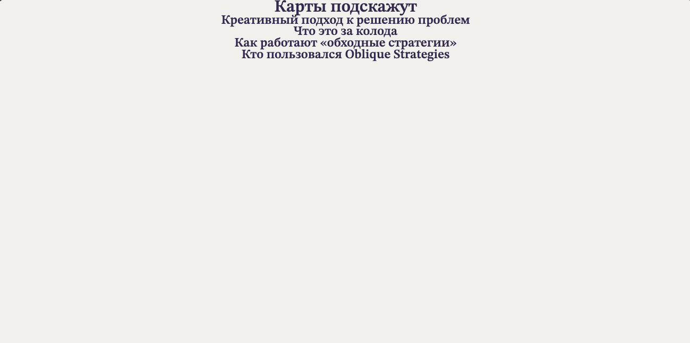
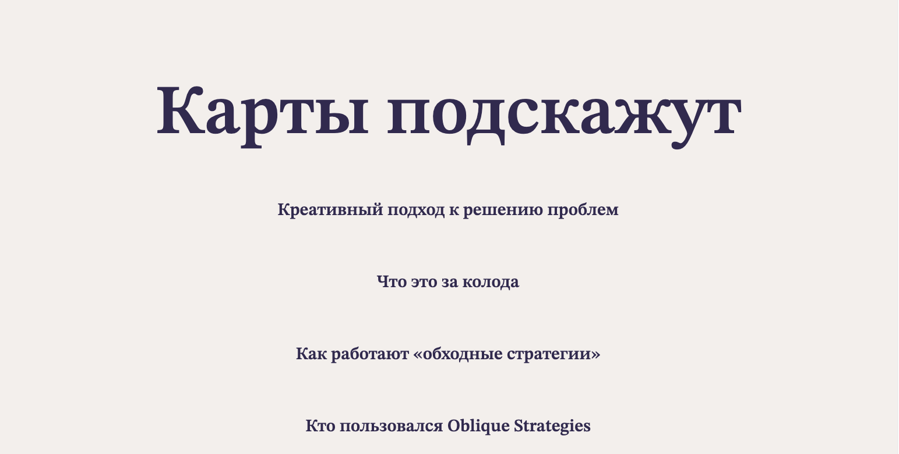
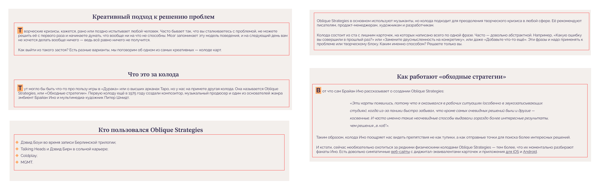
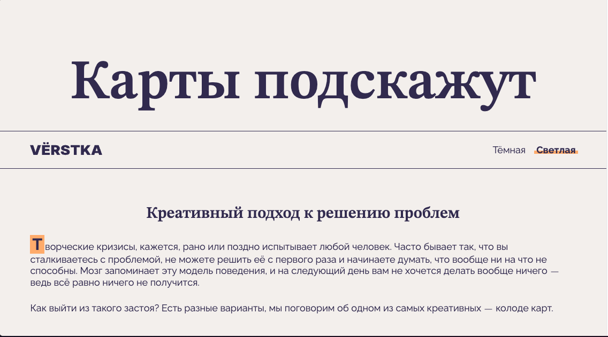

# Задача

Открывайте [макет](https://www.figma.com/design/LjwSixu3rrygML8ddvyxF4/%D0%9A%D0%B0%D1%80%D1%82%D1%8B-%D0%BF%D0%BE%D0%B4%D1%81%D0%BA%D0%B0%D0%B6%D1%83%D1%82?node-id=0-1&p=f&t=xZR11Apg7gshkxbO-0), внимательно посмотрите на него и попытайтесь найти закономерности и повторяющиеся стили, а также
основные различия между светлой и тёмными версиями.

## Заготовка

В [заготовке проекта](https://github.com/practicetasks/karty-podskazhut-main) много интересного. Мы подключили шрифты и фавиконки, а также подготовили изображения в разных
форматах.

В файле главной HTML-страницы есть несколько структурных тегов с присвоенными классами. Обратите внимание на класс
`.theme_dark` у тега `<body>`. Он отвечает за тему всей страницы. Вот к такому результату и нужно прийти: если класс
убрать,
тема будет светлой, а если вернуть — тёмной.

Ещё мы установили дополнительный класс `.content-section` тегу `<main>`. Этот класс будет у тех элементов, которым нужен
типовой отступ по бокам. Вы уже встречались с таким подходом к созданию боковых полей.

Также мы написали скрипт, который будет переключать цветовую тему. Он устанавливает или убирает тот самый класс
`.theme_dark` у тега `<body>` в зависимости от условий. Нужно следить за именами классов всех элементов, которые
верстаются,
чтобы скрипт заработал. Важно включить скрипт, когда вёрстка будет завершена, чтобы не отвлекаться на это в процессе.

В CSS тоже есть немного кода: изменение `box-sizing` для всех элементов, сброс отступов для `body` и элементов, которые
понадобятся на странице.

## Шаг 1. CSS-переменные

Переключение темы делается через CSS-переменные, поэтому лучше подготовить их перед вёрсткой. Темы отличаются:

* цветом фона,
* цветом текста,
* акцентным цветом (подчёркивание у кнопок и выделение текста в карточке).

Для этого зададим такие переменные:

* `--bg-color` — для цвета фона,
* `--text-color` — для цвета текста,
* `--accent-color` — для акцентного цвета.

Чтобы задать этим переменным значения по умолчанию, нужно выбрать тему, которая будет верстаться первой. Предлагаем
начать со светлой. Этой логикой мы будем пользоваться в рекомендациях.
Обычно в переменные также выносят семейства шрифтов, которые есть на сайте, чтобы их можно было быстро изменить при
необходимости. Поэтому рекомендуем добавить такие переменные:

* `--main-font` — имя семейства шрифта преобладающего текста (абзацы);
* `--accent-font` — шрифт для заголовков и особенных текстовых элементов.

А еще важно сверить имена шрифтов с файлом `fonts.css`. Несовпадение вызовет проблемы.

## Шаг 2. Базовая настройка CSS-переменных и повторяющихся элементов

Для всей страницы использованы единый фоновый цвет и цвет основного текста. Семейство шрифтов должно отличаться только в
заголовках. В селекторе `.page` необходимо указать эти значения в виде ссылок на переменные. И не забыть указать
значения
по умолчанию!

Обратите внимание на все заголовки страницы. У них много общего: семейство шрифтов, интерлиньяж, вес шрифта,
выравнивание текста. Необходимо описать этими свойствами селектор `.heading` в CSS. Потом в HTML внести заголовок
первого
уровня в шапку, а все заголовки второго уровня — в `<main>`. А далее нужно присвоить всем этим заголовкам описанный
класс.

Мы написали в HTML класс `.content-section`, который нужен для создания полей по бокам. Теперь опишем его стили. Для
этого
необходимо указать в CSS боковые внутренние отступы для `.content-section` в `5vi` (или физический аналог — `5vw`).
Выбор этих
единиц измерения не случаен. Мы обратим на них внимание во время вёрстки картинки. Значение в пять единиц мы посчитали,
исходя из пропорций макета, они сохраняются и в десктопной, и в мобильной версии. В рабочем процессе этим обычно
занимается дизайнер макета.

Использование внутреннего отступа вместо внешнего открывает более широкие возможности класса `.content-section`. В
будущем
он пригодится внутри меню. А пока нужно присвоить класс `.content-section` заголовку первого уровня, чтобы он тоже
отодвинулся от краёв страницы и не прилипал к ним при сжатии окна браузера.


<p style="text-align: center; color: gray; font-size: 16px;">Результат этого шага</p>

## Шаг 3. Стили заголовков

Заголовок шапки должен быть «резиновым». Это значит, что размер шрифта должен быть задан через функцию `clamp()`. Для
этого нужно воспользоваться сайтом [clamp.font-size.app](https://clamp.font-size.app/) и сгенерировать функцию, исходя
из размера шрифта в максимальной и минимальной ширине макета. А дальше просто присвоить заголовку дополнительный класс
`.header__title` для описания этих свойств.

Также этому заголовку нужен отступ снизу. Его размер можно сделать фиксированным, так как на десктопном и мобильном
макете он совпадает.

Всем заголовкам внутри `<main>` мы зададим один и тот же класс `.content__title`, потому что размер шрифта и отступы от
этих заголовков всегда одинаковые. Класс нужно описать в CSS:

* фиксированный размер шрифта (нужно замерить в макете);
* верхний отступ — 7% ширины;
* нижний отступ — 2.5% ширины.

Другие стили этим заголовкам не нужны.

Заголовок в шапке нужно отодвинуть от её верхней границы внутренним отступом для класса `.header`. Размер отступа — 10%
ширины.


<p style="text-align: center; color: gray; font-size: 16px;">Результат этого шага</p>

## Шаг 4. Абзацы

В макете есть блоки с несколькими абзацами. Первый абзац начинается с буквицы — декорированной первой буквы. К ней мы
перейдём позже, а для реализации механики абзацев нужно создать обёртку вокруг текстовых блоков. Это будет `<div>` с
классом `.content__text-block`. В такие обёртки мы будем помещать абзацы, список и цитату, которые есть в макете.


<p style="text-align: center; color: gray; font-size: 16px;">Красной рамкой обведены обёртки .content__text-block</p>

Общий стиль для обёртки — шрифт статического размера. Необходимо разместить нужное количество таких обёрток на странице
под соответствующими заголовками. А в CSS задать нужный размер шрифта.

```
Подсказка: на странице должно оказаться пять таких блоков. В одном из разделов два блока разбиты картинкой, которую мы
сверстаем чуть позже. 
```

Далее необходимо добавить нужные абзацы во все блоки, кроме последнего — там будет список. Каждый абзац разметить
классом `.content__paragraph`. Цитату абзацем размечать не нужно, добавим её отдельно.

У всех абзацев, кроме последнего в блоке, должны быть нижние отступы. Их размер — `1.5em`. Чтобы реализовать задумку,
придётся составить хитрый селектор. Он должен выбирать все элементы с классом `.content__paragraph`, вложенные в
`.content__text-block`, кроме последнего.

Внутри одного из текстовых блоков есть ссылки на приложения. Вот они:

* iOS — https://apps.apple.com/us/app/oblique-strategies-se/id1104927011
* Android — https://play.google.com/store/apps/details?id=com.monoloco.obliquestrategies&hl=en_US&gl=US&pli=1

Пусть ссылки открываются в новой вкладке. Им также нужно задать принудительное наследование цвета текста от родителя.
Это можно сделать специальными значениями `inherit` или `currentColor`.

<p style="text-align: center; color: gray; font-size: 16px;">Результат этого шага</p>

## Шаг 5. Цитата и список

Цитата встроена в текстовый блок с подзаголовком: «Как работают „обходные стратегии”» после первого абзаца. Необходимо
разметить цитату семантическим тегом и назначить ему класс `.content__blockquote`. В CSS у цитаты будут особенные
свойства
текста и шрифта. Их можно взять из макета. Ширина блока цитаты — это 75% ширины родительского элемента. У цитаты тоже
есть нижний отступ в `1.5em`.

Со списком всё несколько сложнее. Он расположен внутри последнего текстового блока. Оформить его нужно как
маркированный, добавить класс `.content__list`, но отключить отображение маркеров через CSS. Для этого придётся
самостоятельно сверстать кастомные маркеры, используя псевдоэлементы. Ещё этому списку нужно поменять браузерные
внутренние отступы. Они должны быть по 40 пикселей и заданы только слева (`inline-start` — в мире логических свойств).

Чтобы создать кроссбраузерные маркеры для пунктов списка, нужно использовать псевдоэлемент `::before`. Оформить его
следует как квадрат размером 15×15 пикселей, с фоновой картинкой `marker-light.svg`. Картинку подогнать под размер
квадрата и разместить в его центре, без повтора на фоне. Потом необходимо передвинуть псевдоэлемент на нужное положение
через абсолютное позиционирование и отступы. Для этого придётся задать относительное позиционирование пункту списка.
Можно сначала разместить квадрат на глаз, а в конце работы подогнать всё с помощью плагина Pixel Perfect.

Ещё у каждого пункта списка, кроме последнего, должен быть нижний отступ в 10 пикселей.

<p style="text-align: center; color: gray; font-size: 16px;">Результат этого шага</p>

## Шаг 6. Буквица

Первые буквы в первом абзаце каждого подраздела выделены специальными стилями. Такую логику лучше задать не для
конкретной буквы и не для абзацев, а для всего текстового блока: если сайт будет развиваться, возможно, захочется
отказаться от некоторых буквиц.

Все абзацы лежат в обёртках `.content__text-block`. Необходимо добавить к нужным обёрткам класс
`.content__text-block_type_first-lettered`. Он будет отвечать за появление буквицы внутри текстового блока. Обратите
внимание, что этот класс нужен не всем блокам текста. Один из блоков продолжает повествование в подразделе после
изображения, там буквица не нужна.

Для описания буквицы нужно будет составить достаточно сложный селектор. Этот селектор должен выбирать первый класс
`.content__paragraph` внутри класса `.content__text-block_type_first-lettered` и получать первую букву этого абзаца
псевдоклассом `:first-letter`.

В качестве фона для первой буквы необходимо использовать значение CSS-переменной `--accent-color`.

Ещё из особенностей — придётся задать первой букве небольшой `padding` в `4px` слева и справа, а также правый внешний
отступ
в `1px`. Так получится приблизиться к макету, хотя идеального совпадения не получится из-за особенностей отрисовки этого
шрифта браузером. Чтобы использовать отступы, придётся сделать первую букву блочно-строчной.

## Шаг 7. Изображение

Для изображений с подписями в HTML есть специальный контейнер `<figure>`. Типовая разметка такая:

```html
<figure>
  
  <figcaption>
    Описание изображения
  </figcaption>
</figure>
```

Этим контейнером и нужно воспользоваться для организации лейаута картинки. Необходимо задать контейнеру класс
`.content__figure`. А описанию — класс `.content__picture-caption`.

Загляните в папку `img/` — там мы собрали изображения в разных форматах и в двух размерах. Мы делали это через сайт
[Squoosh](https://squoosh.app/) (просто напоминание). Нужно использовать тег `<picture>`, чтобы указать все форматы и
вариации размеров. А ещё важно не забыть про ленивую загрузку. Тегу изображения внутри `<picture>` нужно присвоить класс
`.content__picture`.

Изображению `.content__picture` задать такую же ширину, как у родителя — `.content__figure`. А вот с самим родителем
придётся повозиться. Для начала нужно задать ему вертикальные внешние отступы в `7%` ширины.

А теперь трюк 🥁. Изображение должно быть шириной во всю страницу, при этом оставаясь в контейнере с отступами по бокам.
Идея такая: установить бóльшую ширину контейнера с картинкой, вычислив по формуле: 100% + сумма размеров боковых полей.
Потом сдвинуть картинку влево на размер бокового поля.

Для решения этой задачи понадобится применить функцию `calc()`. Сдвиг влево можно реализовать через относительное
позиционирование блока и указание соответствующего размера сдвига.

💡 Мы задали поля секции с контентом в единицах `vi` (или `vw`), помните? Если бы они были заданы в процентах, такое
вычисление было бы невозможным. Внутри функции `calc()` проценты считались бы уже от ширины родителя, а не от ширины
всей
страницы. Остановитесь и обдумайте это.

Остаётся только сверстать блок с подписью к картинке. С ним всё просто — нижняя граница, отступы, настройки текста.


<p style="text-align: center; color: gray; font-size: 16px;">Результат этого шага</p>

## Шаг 8. Карточка

Карточка перед списком — контейнер `<article>` с заголовком третьего уровня и абзацем внутри. Нужно использовать такие
классы:

* `.content__card` — контейнер с карточкой;
* `.content__card-title` — заголовок карточки;
* `.content__card-subtitle` — абзац.

У заголовка карточки должны быть все стили, которые применяются к остальным заголовкам. Для этого мы ранее создавали
класс `.heading`. Добавим и его заголовку.

Чтобы создать красивое перечёркивание слов old idea, придётся обернуть их в `<span>` с классом `.colored-text`. После
этого
можно начинать писать стили.

Контейнер карточки должен быть выполнен в пропорциях `4/3`. Для указания пропорций есть специальное свойство. Ещё у
контейнера должен быть верхний отступ в `7%` ширины. Остальные свойства подсказывать не будем: граница, выравнивание
всего
по центру блока — это для вас не новости. Единственное — необходимо использовать для обозначения цветов границ значение
`currentColor` или ссылку на CSS-переменную. Так цвет границы будет меняться при переключении темы.

Заголовку и подзаголовку зададим фиксированные размеры шрифтов из макета.

А вот с `.colored-text` придётся повозиться. Такое перечёркивание нужно делать псевдоэлементом. Мы выбрали `::after`.
Этот
псевдоэлемент нужно спозиционировать абсолютно. При этом вычислить ширину, превосходящую размер элемента `<span>`.
Высоту
этого элемента удобно привязать к размеру одной из букв в шрифте, используя единицы `em` или `ch`. Цвет фона
получившейся из
псевдоэлемента полосы нужно привязать к значению CSS-переменной `--accent-color`. Отправить полосу на задний план можно,
указав ей `z-index: -1;`. Без плагина Pixel Perfect этот элемент сложно сверстать точно. Можно сверстать примерно
похоже,
а в конце пройтись по всему макету и подогнать размеры и координаты позиционирования.

<p style="text-align: center; color: gray; font-size: 16px;">Результат этого шага</p>

## Шаг 9. Логотип и переключатель тем

Под заголовком первого уровня, в шапке должен появиться контейнер `<nav>` с двумя классами: `.header__menu` и
`.content-section`. Взгляните на макет, ещё раз обратите внимание, почему у класса `.content-section` задан внутренний
отступ, а не внешний.

В полосе навигации два блока — логотип и переключатель тем. Здесь требуется использовать встроенный в HTML SVG. Это всё
вы пройдёте в следующих темах. Вот код:

```html

<div class="header__logo">
  <svg xmlns="http://www.w3.org/2000/svg" width="135" height="25">
    <use href="./images/logo.svg#logo"></use>
  </svg>
</div>
```

Переключатель тем — список с двумя кнопками внутри пунктов. Вот классы, которые нужно использовать:

* `.header__theme-toggler` — контейнер списка;
* `.header__theme-button` — обе кнопки;
* `.header__theme-button_type_dark` — кнопка тёмной темы;
* `.header__theme-button_type_light` — кнопка светлой темы;
* `.header__theme-button_is-active` — включённая в текущий момент кнопка.

Включённой кнопке нужно добавить атрибут `disabled`, чтобы на неё нельзя было нажать.

Контейнер `.header__menu` довольно просто сверстать на флексах или гридах. Вертикальные отступы в нём статические, их
возьмём из макета.

Контейнер списка — тоже знакомая задача. Сбросить отступы и маркеры, сделать флекс-строкой с отступами в `20px` и
готово.

Для вёрстки кнопок подсказки такие: принудительно нужно наследовать семейство шрифта значением `inherit`, а цвет текста
в
кнопке задать значением `currentColor` или привязать к переменной. Так цвет будет реагировать на изменение темы в
окружении.

Обратите внимание, что у кнопок появляется подчёркивание при наведении, а у активной кнопки меняется вес шрифта. И важно
добавить кнопкам значение `cursor: pointer`. Так при наведении на них пользователь увидит изменение курсора.

Красивое перечёркивание под активной кнопкой делается по аналогии с оформлением псевдоэлемента `::after` в карточке.
Логика такая же, почти все свойства аналогичны, несколько значений отличаются.


<p style="text-align: center; color: gray; font-size: 16px;">Результат этого шага</p>

## Шаг 10. Состояния

У кнопок и ссылок на странице одинаковые состояния. При вёрстке этой работы мы сбросили `outline` для всех кнопок и
ссылок
в состоянии фокус, выбрав их не по классу, а по тегу. Новый `outline` для состояния `:focus-visible` этих элементов —
несложная задача. Только нужно помнить, что цвета поменяются, значит, нужно использовать `currentColor` или ссылки на
переменные.

Кроме фокусов, нужно добавить кнопке стиль `pointer-events: none;` для состояния `disabled`. Тогда никакие события
курсора
не будут доступны для этой кнопки.

## Шаг 11. Подвал сайта

Для этой секции важно помнить про меняющийся в тёмной теме цвет и использовать ключевые слова. Отступ сверху — `10%`
ширины, внутренний отступ до текста — `2.5%` со всех сторон. Абзацу текста внутри нужно задать класс
`.footer__copyright`. У
него фиксированный размер шрифта.

## Шаг 12. Тёмная тема, наконец-то!

Всей тёмной темой управляет один класс на `body` — `.theme_dark`. Если до этого он был убран, нужно его вернуть.

А теперь необходимо переопределить переменные `--bg-color`, `--text-color` для этого селектора и посмотреть на
результат. Должно поменяться всё, кроме элементов, выделенных цветом `--accent-color`.

_Предвестник тёмной темы_

Переменную `--accent-color` тоже нужно переопределить — на `transparent`. Цвет станет прозрачным. Макет предполагает,
что акцентное выделение в тёмной теме происходит фоновым рисунком, а буквица выглядит иначе.

Для всех этих изменений мы будем использовать один и тот же подход: формировать соответствующий селектор, описывая его
как вложенный в элемент с классом `.theme_dark`.

Например, активная кнопка. Был селектор `.header__theme-button_is-active::after`, а под ним должен появиться `.theme_dark
.header__theme-button_is-active::after` со свойством фоновой картинки `pattern.svg`.

То же самое нужно проделать со сложным селектором буквицы, а потом задать в новом селекторе тёмной буквицы границу.

С псевдоэлементом у `.colored-text` всё так же, как с кнопкой.

И финальный штрих — маркеру в списке нужно заменить фоновое изображение на `marker-dark.svg`.

Момент истины: нужно раскомментировать строку со скриптом в HTML-файле. Темы начнут переключаться. Если этого не
происходит, значит, есть ошибка в именах классов элементов.


_Работающая тёмная тема_

_«Резиновая» вёрстка_